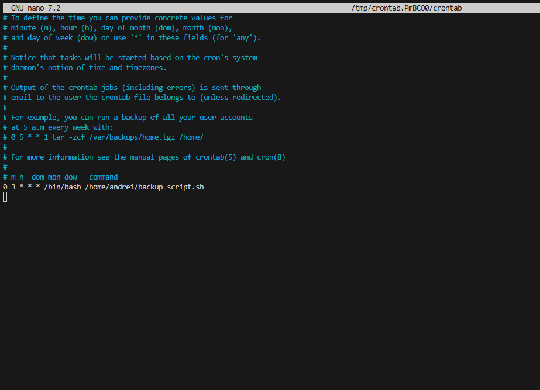
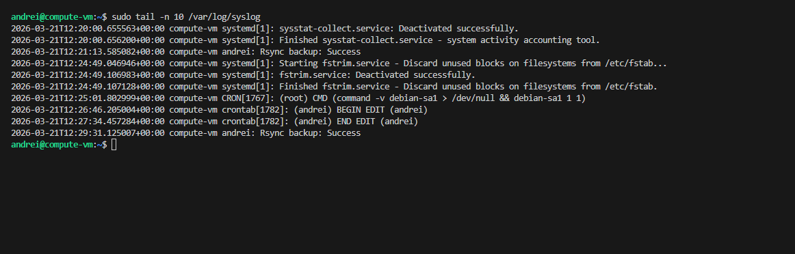

# Домашнее задание к занятию "`Домашнее задание к занятию 3 «Резервное копирование" - `Петровский Андрей`


### Задание 1
- Составьте команду rsync, которая позволяет создавать зеркальную копию домашней директории пользователя в директорию `/tmp/backup`
- Необходимо исключить из синхронизации все директории, начинающиеся с точки (скрытые)
- Необходимо сделать так, чтобы rsync подсчитывал хэш-суммы для всех файлов, даже если их время модификации и размер идентичны в источнике и приемнике.
- На проверку направить скриншот с командой и результатом ее выполнения

### Решение задание 1

```bash
rsync -av --delete --checksum --exclude=".*" ~/ /tmp/backup/

```
 - Описание ключей:

    - -a (archive) — сохранение прав доступа, владельцев и временных меток файлов.

    - -v (verbose) — подробный вывод процесса синхронизации.

    - --delete — создание зеркальной копии (удаление файлов в целевой директории, если они удалены в источнике).

    - --checksum — принудительная проверка контрольных сумм файлов вместо стандартной проверки по дате и размеру.

    - --exclude=".*" — исключение всех скрытых файлов и директорий, начинающихся с точки.

    - ~/ — источник (домашняя директория пользователя).
   
    - /tmp/backup/ — путь назначения для резервной копии.


    


### Задание 2
- Написать скрипт и настроить задачу на регулярное резервное копирование домашней директории пользователя с помощью rsync и cron.
- Резервная копия должна быть полностью зеркальной
- Резервная копия должна создаваться раз в день, в системном логе должна появляться запись об успешном или неуспешном выполнении операции
- Резервная копия размещается локально, в директории `/tmp/backup`
- На проверку направить файл crontab и скриншот с результатом работы утилиты.

### Решение 

```bash
#!/bin/bash
# Запуск зеркальной синхронизации без скрытых файлов
rsync -av --delete --exclude=".*" ~/ /tmp/backup/

# Логирование результата в системный журнал syslog
if [ $? -eq 0 ]; then
    logger "Rsync backup: Success"
else
    logger "Rsync backup: Error"
fi
```

cron 



check


