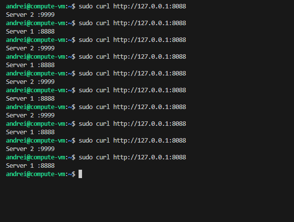
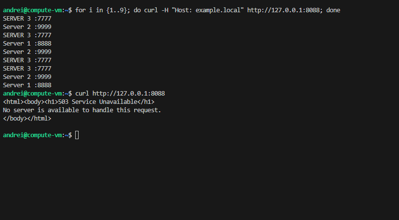

# Домашнее задание к занятию "`Домашнее задание к занятию 2 «Кластеризация и балансировка нагрузки»" - `Петровский Андрей`


### Задание 1
- Запустите два simple python сервера на своей виртуальной машине на разных портах
- Установите и настройте HAProxy, воспользуйтесь материалами к лекции по [ссылке](2/)
- Настройте балансировку Round-robin на 4 уровне.
- На проверку направьте конфигурационный файл haproxy, скриншоты, где видно перенаправление запросов на разные серверы при обращении к HAProxy.


### Решение : Балансировка Round-robin на 4 уровне (L4)
Описание:

Настроена балансировка TCP-трафика между двумя Python-серверами. HAProxy перенаправляет запросы по очереди на каждый сервер, не анализируя содержимое пакетов.

- Порт HAProxy: 8088

 - Сервер 1: 127.0.0.1:8888

 - Сервер 2: 127.0.0.1:9999

 - Режим: mode tcp

 - Алгоритм: roundrobin

 конфигурация
```bash
listen stats  # веб-страница со статистикой
        bind                    :888
        mode                    http
        stats                   enable
        stats uri               /stats
        stats refresh           5s
        stats realm             Haproxy\ Statistics

frontend example  # секция фронтенд
        mode tcp
        bind :8088
        default_backend web_servers


backend web_servers    # секция бэкенд
        mode tcp
        balance roundrobin
        option httpchk
        http-check send meth GET uri /index.html
        server s1 127.0.0.1:8888 check
        server s2 127.0.0.1:9999 check
``` 



-------------------------------------------------------------------------

### Задание 2
- Запустите три simple python сервера на своей виртуальной машине на разных портах
- Настройте балансировку Weighted Round Robin на 7 уровне, чтобы первый сервер имел вес 2, второй - 3, а третий - 4
- HAproxy должен балансировать только тот http-трафик, который адресован домену example.local
- На проверку направьте конфигурационный файл haproxy, скриншоты, где видно перенаправление запросов на разные серверы при обращении к HAProxy c использованием домена example.local и без него.

### Решение Задание 2: Weighted Round Robin на 7 уровне (L7)
Описание:

Настроена балансировка HTTP-трафика между тремя серверами с использованием весов и проверкой доменного имени (ACL).

    Условие: Балансировка работает только при обращении к домену example.local.

    Алгоритм: roundrobin с весами (weight).

- Распределение весов:

    - Server 1 (порт 8888) — weight 2

    - Server 2 (port 9999) — weight 3

    -  Server 3 (port 7777) — weight 4
```bash
frontend http_front
    bind *:8088
    mode http                       
    
    # ACL: проверяем заголовок Host
    acl is_example_local hdr(host) -i example.local
    
    # Направляем в бэкенд только если домен совпадает
    use_backend web_servers_weighted if is_example_local

backend web_servers_weighted
    mode http                       
    balance roundrobin              # Алгоритм тот же, но с весами
    
    # Настраиваем серверы с весами 
    server s1 127.0.0.1:8888 weight 2 check
    server s2 127.0.0.1:9999 weight 3 check
    server s3 127.0.0.1:7777 weight 4 check

```
 - Результаты тестирования:

    - Запрос с использованием домена (-H "Host: example.local"):
    - При выполнении цикла из 9 запросов распределение ответов соответствует заданным весам (2:3:4).

    - Запрос без использования домена:
    - При обращении напрямую по IP-адресу без указания заголовка Host, HAProxy возвращает ошибку 503 Service  Unavailable, так как условие ACL не выполнено.

 Скриншоты проверки:

    Проверка распределения весов и ACL:


