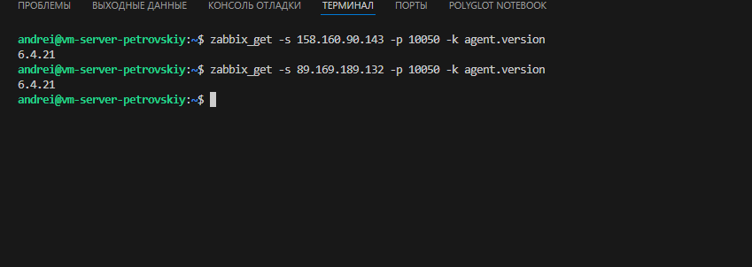
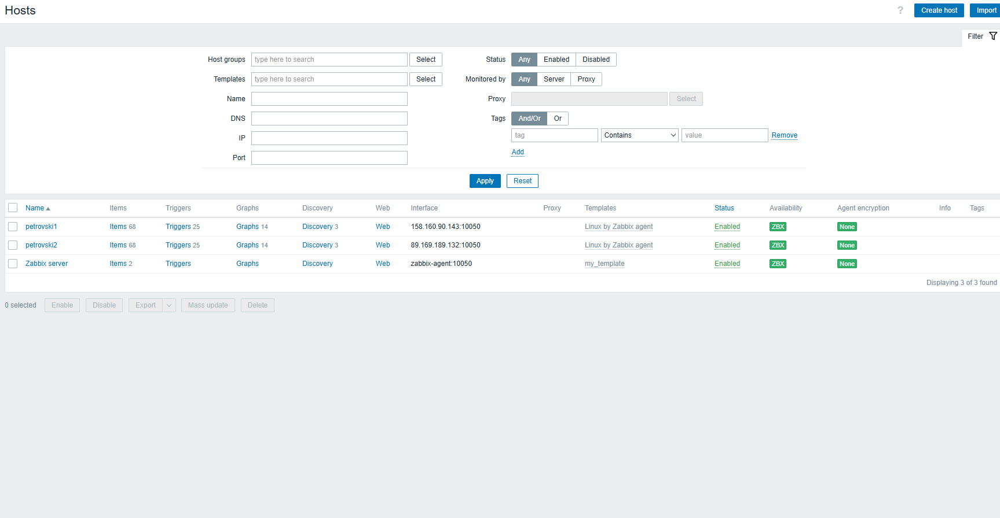
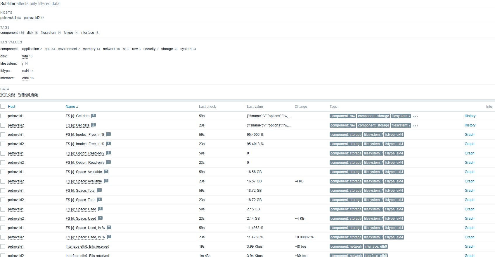
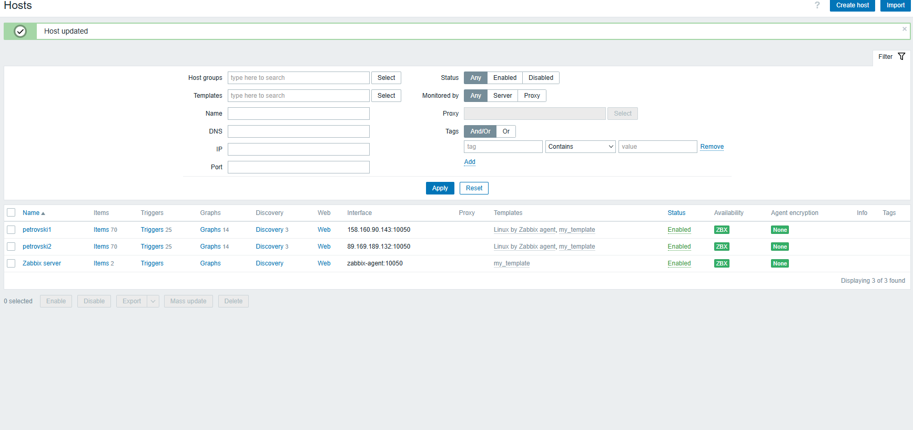
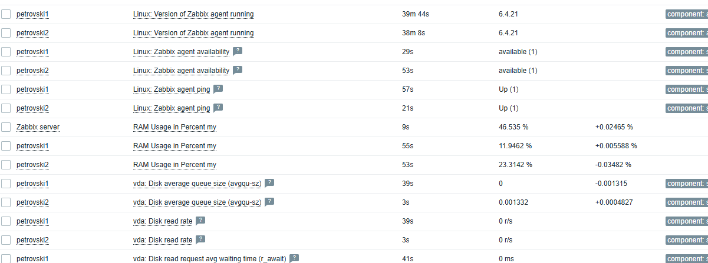
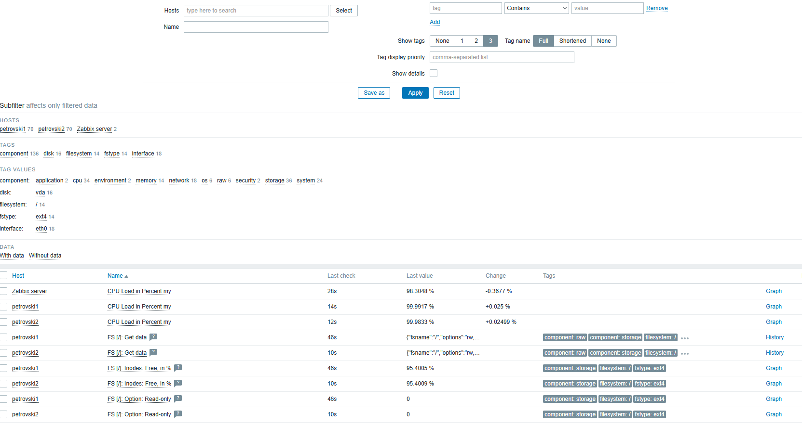

# Домашнее задание к занятию "`Система мониторинга Zabbix. Часть 2`" - `Петровский Андрей`

### Задание 1
Создайте свой шаблон, в котором будут элементы данных, мониторящие загрузку CPU и RAM хоста.

#### Процесс выполнения
1. Выполняя ДЗ сверяйтесь с процессом отражённым в записи лекции.
2. В веб-интерфейсе Zabbix Servera в разделе Templates создайте новый шаблон
3. Создайте Item который будет собирать информацию об загрузке CPU в процентах
4. Создайте Item который будет собирать информацию об загрузке RAM в процентах

#### Требования к результату
- [ ] Прикрепите в файл README.md скриншот страницы шаблона с названием «Задание 1»

 ----------------------------------------------------------------

 Задание 1 решение развернуть 

## Screnshots

# template

# cpu

# ram

# Latest Data

### Задание 2
Добавьте в Zabbix два хоста и задайте им имена <фамилия и инициалы-1> и <фамилия и инициалы-2>. Например: ivanovii-1 и ivanovii-2.

#### Процесс выполнения
1. Выполняя ДЗ сверяйтесь с процессом отражённым в записи лекции.
2. Установите Zabbix Agent на 2 виртмашины, одной из них может быть ваш Zabbix Server
3. Добавьте Zabbix Server в список разрешенных серверов ваших Zabbix Agentов
4. Добавьте Zabbix Agentов в раздел Configuration > Hosts вашего Zabbix Servera
5. Прикрепите за каждым хостом шаблон Linux by Zabbix Agent
6. Проверьте что в разделе Latest Data начали появляться данные с добавленных агентов

#### Требования к результату
- [ ] Результат данного задания сдавайте вместе с заданием 3

 ---
 

  
<b>Задание 2: Подключение внешних хостов (нажми, чтобы развернуть)</b>

  ## Ход работы
  1. На виртуальные машины был установлен `zabbix-agent`.
  2. В конфигурационном файле `/etc/zabbix/zabbix_agentd.conf` был разрешен доступ для IP Zabbix-сервера.
  3. Проверка связи выполнена с сервера с помощью утилиты `zabbix_get`.

  **Подтверждение связи (скриншот терминала):**
  

  **Результат в интерфейсе:**
  - Оба хоста (`petrovskii-1` и `petrovskii-2`) добавлены в раздел Hosts.
  - Статус ZBX горит зеленым.
  - Данные успешно поступают в раздел "Latest data".

   **Latest data hosts:**

 

### Задание 3
Привяжите созданный шаблон к двум хостам. Также привяжите к обоим хостам шаблон Linux by Zabbix Agent.

#### Процесс выполнения
1. Выполняя ДЗ сверяйтесь с процессом отражённым в записи лекции.
2. Зайдите в настройки каждого хоста и в разделе Templates прикрепите к этому хосту ваш шаблон
3. Так же к каждому хосту привяжите шаблон Linux by Zabbix Agent
4. Проверьте что в раздел Latest Data начали поступать необходимые данные из вашего шаблона

#### Требования к результату
- [ ] Прикрепите в файл README.md скриншот страницы хостов, где будут видны привязки шаблонов с названиями «Задание 2-3». Хосты должны иметь зелёный статус подключения

 ---
 

  
<b>Задание 3: Привязка шаблонов (Задание 2-3)</b>

  ## Итоговая конфигурация хостов
  Для хостов `petrovski1` и `petrovski2` произведена одновременная привязка двух шаблонов: стандартного `Linux by Zabbix agent` и пользовательского `my_template`.

  **Решение проблемы дублирования ключей:**
  * При попытке использования идентичных ключей в разных шаблонах возникала ошибка "Cannot inherit items... key must be unique".
  * Конфликт был решен путем использования в `my_template` уникального формата ключа `system.cpu.util[,,avg1]`, который поддерживается агентом по умолчанию и не дублируется в системном шаблоне.

  **Результат (Статус хостов):**
  Оба хоста имеют статус **Enabled** и активное соединение **ZBX** (зеленый индикатор).
  
  **Итоговый статус хостов:**
  

  ## В latest Data начали поступать данные о ram и cpu из my_template

  **RAM:**
  

  ***CPU:**
   

