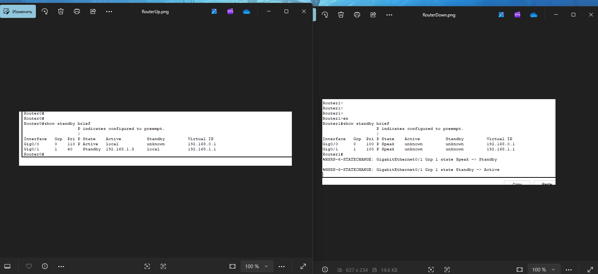

# Домашнее задание к занятию "`Домашнее задание к занятию 1 «Disaster recovery и Keepalived»`" - `Петровский Андрей`


### Задание 1
- Дана [схема](1/hsrp_advanced.pkt) для Cisco Packet Tracer, рассматриваемая в лекции.
- На данной схеме уже настроено отслеживание интерфейсов маршрутизаторов Gi0/1 (для нулевой группы)
- Необходимо аналогично настроить отслеживание состояния интерфейсов Gi0/0 (для первой группы).
- Для проверки корректности настройки, разорвите один из кабелей между одним из маршрутизаторов и Switch0 и запустите ping между PC0 и Server0.
- На проверку отправьте получившуюся схему в формате pkt и скриншот, где виден процесс настройки маршрутизатора.

------

### Решение 

# Решение Задания №1: Настройка HSRP Object Tracking

**Цель:** Обеспечить отказоустойчивость серверного сегмента (Группа 1) при сбоях в клиентском сегменте (интерфейсы Gi0/0).

---

### 1. Описание выполненных настроек

Согласно заданию, в схеме уже было настроено отслеживание интерфейсов Gi0/1 для нулевой группы. Мною была произведена аналогичная настройка для **первой группы (HSRP Group 1)**, отвечающей за шлюз сервера (`192.168.1.1`). 

Теперь интерфейсы **Gi0/1** на обоих маршрутизаторах отслеживают состояние своих портов **Gi0/0**.

#### Команды конфигурации:
На каждом маршрутизаторе (Router0 и Router1) в режиме конфигурации интерфейса Gi0/1 были введены следующие команды:

```ios
interface GigabitEthernet0/1
 standby 1 track GigabitEthernet0/0 70
 ```
 2. Проверка (Разрыв кабеля)

Для проверки был удален кабель между Router0 и Switch0 (интерфейс Gi0/0).

Результат:

    Механизм Tracking мгновенно снизил приоритет Router0 в первой группе со 110 до 40 (видно на скриншоте Routers.png).

    Роль Active для шлюза сервера (192.168.1.1) автоматически перешла ко второму маршрутизатору.

    Связь между PC0 и Server0 не прервалась — ping проходит успешно через резервный путь

## Routers screnshot



### Задание 2
- Запустите две виртуальные машины Linux, установите и настройте сервис Keepalived как в лекции, используя пример конфигурационного [файла](1/keepalived-simple.conf).
- Настройте любой веб-сервер (например, nginx или simple python server) на двух виртуальных машинах
- Напишите Bash-скрипт, который будет проверять доступность порта данного веб-сервера и существование файла index.html в root-директории данного веб-сервера.
- Настройте Keepalived так, чтобы он запускал данный скрипт каждые 3 секунды и переносил виртуальный IP на другой сервер, если bash-скрипт завершался с кодом, отличным от нуля (то есть порт веб-сервера был недоступен или отсутствовал index.html). Используйте для этого секцию vrrp_script
- На проверку отправьте получившейся bash-скрипт и конфигурационный файл keepalived, а также скриншот с демонстрацией переезда плавающего ip на другой сервер в случае недоступности порта или файла index.html


------

### Решение по Заданию 2: Настройка Keepalived и Bash-скрипта проверки
1. Bash-скрипт проверки

Скрипт проверяет доступность порта 80 и наличие файла index.html. Сохранен по пути: /etc/keepalived/check_web.sh
#!/bin/bash

# Проверка доступности порта 80 (nginx)
```bash
nc -z localhost 80
PORT_STATUS=$?

# Проверка существования файла index.html в root-директории
if [ -f /var/www/html/index.html ] && [ $PORT_STATUS -eq 0 ]; then
  exit 0 # Успех
else
  exit 1 # Ошибка (триггер для переноса IP)
fi
```