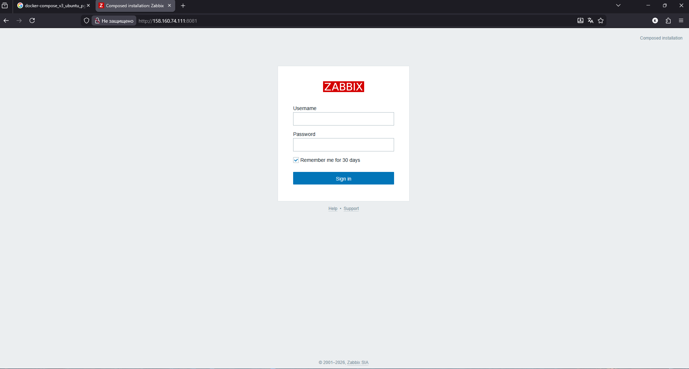

# Домашнее задание к занятию "`Система мониторинга Zabbix`" - `Петровский Андрей`


### Задание 1 

Установите Zabbix Server с веб-интерфейсом.

#### Процесс выполнения
1. Выполняя ДЗ, сверяйтесь с процессом отражённым в записи лекции.
2. Установите PostgreSQL. Для установки достаточна та версия, что есть в системном репозитороии Debian 11.
3. Пользуясь конфигуратором команд с официального сайта, составьте набор команд для установки последней версии Zabbix с поддержкой PostgreSQL и Apache.
4. Выполните все необходимые команды для установки Zabbix Server и Zabbix Web Server.

#### Требования к результатам 
1. Прикрепите в файл README.md скриншот авторизации в админке.
2. Приложите в файл README.md текст использованных команд в GitHub.

----------------------------------------------------------


### Решение Задания 1: Установка Zabbix Server с веб-интерфейсом
В ходе выполнения домашнего задания был развернут стек мониторинга Zabbix с использованием контейнеризации (Docker Compose), что является современным стандартом развертывания, обеспечивающим изоляцию компонентов.
1. Используемые компоненты

    Операционная система: Ubuntu (в соответствии с выбранным YAML-конфигом).
    СУБД: PostgreSQL 17 (Alpine-based).
    Веб-сервер: Apache.
    Zabbix Version: 7.4-latest.

2. Список выполненных команд
Для установки и запуска системы использовались следующие команды в терминале:

```bash
# 1. Обновление системных пакетов и установка Docker Compose V2
sudo apt-get update
sudo apt-get install docker-compose-plugin

# 2. Клонирование официального репозитория Zabbix Docker
git clone https://github.com
cd zabbix-docker

# 3. Остановка и очистка старых контейнеров (если были)
sudo docker compose -f docker-compose_v3_ubuntu_pgsql_latest.yaml down

# 4. Запуск стека Zabbix с PostgreSQL и Apache
# Мы выбираем конкретные сервисы из общего шаблона для экономии ресурсов
sudo docker compose -f docker-compose_v3_ubuntu_pgsql_latest.yaml up -d \
  postgres-server \
  server-db-init \
  zabbix-server \
  zabbix-web-apache-pgsql \
  zabbix-agent

# 5. Проверка статуса запущенных контейнеров
sudo docker ps
```
3. Скриншот авторизации в админке
Ниже представлен скриншот окна авторизации в веб-интерфейсе Zabbix (доступен по порту 8081).



